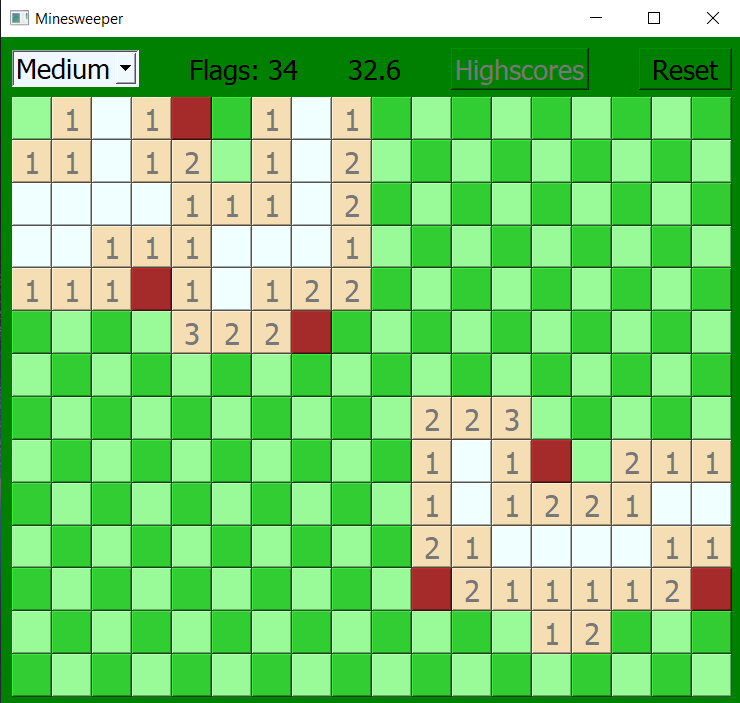
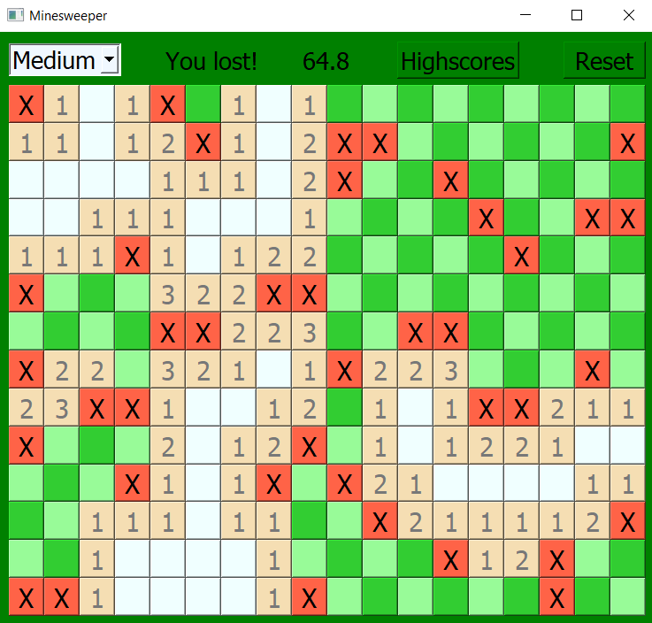
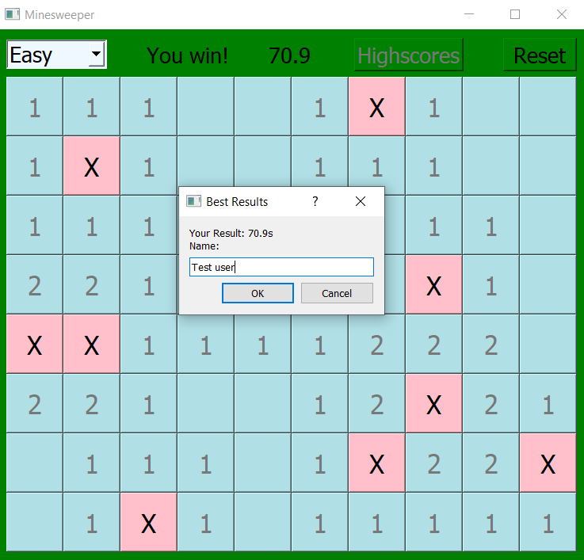
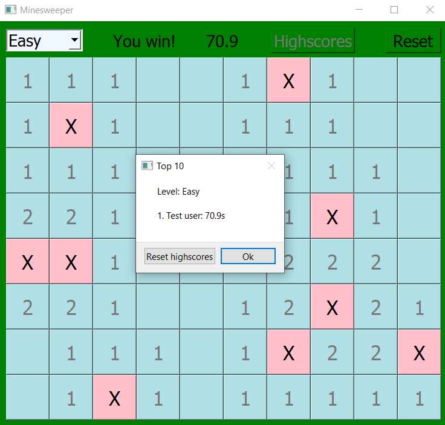

# University project: minesweeper desktop application in QT

<table>
  <tr>
    <td>Level easy</td>
     <td>Level medium</td>
     <td>Level hard</td>
  </tr>
  <tr>
    <td></td>
    <td></td>
    <td></td>
  </tr>
 </table>

<table>
  <tr>
    <td>Game on</td>
     <td>Game over</td>
  </tr>
  <tr>
    <td></td>
    <td></td>
  </tr>
 </table>
 
 <table>
  <tr>
    <td>After win</td>
     <td>Highscores</td>
  </tr>
  <tr>
    <td></td>
    <td></td>
  </tr>
 </table>
